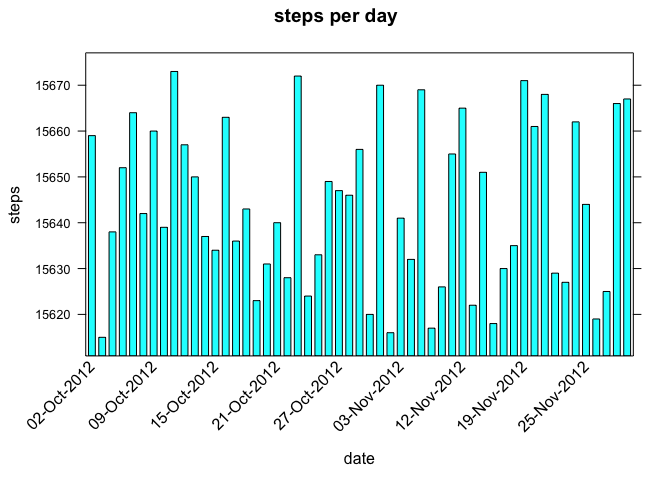
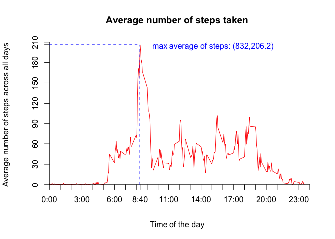
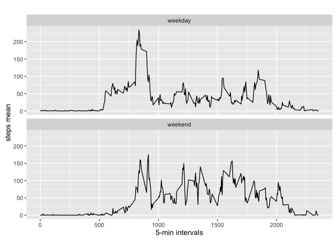

# Reproducible Research: Project One


## Loading and preprocessing the data

Show any code that is needed to 

1. Load the data (i.e. read.csv())

2. Process/transform the data (if necessary) into a format suitable for your analysis


```r
## Use loadpackages(), a user defined function, to load multiple packages.
source("loadpackages.R")
packages <- c("plyr", "lattice", "data.table", "httr", "ggplot2")
loadpackages(packages)
```

```
## Loading required package: plyr
```

```
## Loading required package: lattice
```

```
## Loading required package: data.table
```

```
## Loading required package: httr
```

```
## Loading required package: ggplot2
```

```
## Warning: package 'ggplot2' was built under R version 3.2.3
```

```
##       plyr    lattice data.table       httr    ggplot2 
##       TRUE       TRUE       TRUE       TRUE       TRUE
```

```r
## Getting, extracting and loading the data
url <- "https://d396qusza40orc.cloudfront.net/repdata%2Fdata%2Factivity.zip"
data <- "data"
if(!file.exists(data)){
  dir.create(data)
} 
## download file if it is not already downloaded
zip <- paste(getwd(), "/activity.zip", sep = "")
if(!file.exists(zip)){
	download.file(url, zip, method="curl", mode="wb")
}
## unzip the file if it is not already unzipped
unzippedfile <- paste(getwd(), "/data/activity.csv", sep = "")
if(!file.exists(unzippedfile)){
	unzip(zip, list = FALSE, overwrite = FALSE, exdir = data)
}
## Load the data
activity <- read.table(file = unzippedfile, header = TRUE, sep = ",")
```

## What is mean total number of steps taken per day?

For this part of the assignment, you can ignore the missing values in the dataset.

1. Make a histogram of the total number of steps taken each day

2. Calculate and report the mean and median total number of steps taken per day


```r
## format date and time
activity$dateandtime <- as.POSIXct(with(activity, paste(date, paste(interval %/% 100, interval %% 100, sep=":"))),
    format="%Y-%m-%d %H:%M",tz="")
## steps per day
steps_in_a_day <- setNames(aggregate(steps~as.Date(date), activity, sum, na.rm = TRUE), c("date","steps"))

## prepare ploting parameters
x_axis <- seq(1, nrow(steps_in_a_day), by = 6)
scale <- list(x = list(rot = 45, cex = 1.0, labels = format(steps_in_a_day$date, "%d-%b-%Y")[x_axis], at = x_axis))
## plotting
barchart(date ~ steps, data = steps_in_a_day, main = "steps per day", ylab = "steps", xlab = "date", scales = scale, horizontal = F)
```

\

```r
## calculate the mean
paste("mean:", mean(steps_in_a_day$steps))
```

```
## [1] "mean: 10766.1886792453"
```

```r
## calculate the median
paste("median:", median(steps_in_a_day$steps))
```

```
## [1] "median: 10765"
```

## What is the average daily activity pattern?

1. Make a time series plot (i.e. type = "l") of the 5-minute interval (x-axis) and the average number of steps taken, averaged across all days (y-axis)

2. Which 5-minute interval, on average across all the days in the dataset, contains the maximum number of steps?


```r
## plotting parameter
time_series <- aggregate(steps ~ interval, data = activity, FUN = mean)
## plotting
plot(time_series, type = "l", axes = F, xlab = "Time of the day", 
    ylab = "Average number of steps across all days", main = "Average number of steps taken", 
    col = "red")
axis(1,at=c(seq(0,2400,100),835), label = paste(c(seq(0,24,1),8),c(rep(":00",25),":40"),sep=""), pos = 0)
axis(2, at=c(seq(0,210,30),206.2), label = c(seq(0,210,30),206.2), pos = 0)
max <- which.max(time_series$steps)
segments(832, 0, 832, 206.2, col = "blue", lty = "dashed")
text(835,200, "max average of steps: (832,206.2)", col = "blue", adj = c(-.1, -.1))
segments(0, 206.2, 832, 206.2, col = "blue", lty = "dashed")
```

\

```r
time_series [max, ]
```

```
##     interval    steps
## 104      835 206.1698
```

```r
## calculate when maximum number of steps occured
max_step <- which.max(time_series$steps)/12
paste(max_step, "is equivalent to 8.667 hours, from this we can say that maximum is reached at 8:40 am")
```

```
## [1] "8.66666666666667 is equivalent to 8.667 hours, from this we can say that maximum is reached at 8:40 am"
```

## Imputing missing values

Note that there are a number of days/intervals where there are missing values (coded as NA). The presence of missing days may introduce bias into some calculations or summaries of the data.

1. Calculate and report the total number of missing values in the dataset (i.e. the total number of rows with NAs)

2. Devise a strategy for filling in all of the missing values in the dataset. The strategy does not need to be sophisticated. For example, you could use the mean/median for that day, or the mean for that 5-minute interval, etc.

3. Create a new dataset that is equal to the original dataset but with the missing data filled in.

4. Make a histogram of the total number of steps taken each day and Calculate and report the mean and median total number of steps taken per day. Do these values differ from the estimates from the first part of the assignment? What is the impact of imputing missing data on the estimates of the total daily number of steps?


```r
## total missing values
paste("Total number of missing values:", sum(is.na(activity$steps)))
```

```
## [1] "Total number of missing values: 2304"
```

```r
"missing values can be replaced with the sample mean instead of replacing them with zero. Replacing them with zero will bias the estimate."
```

```
## [1] "missing values can be replaced with the sample mean instead of replacing them with zero. Replacing them with zero will bias the estimate."
```

```r
## create new dataset
new_dataset <- activity
new_dataset[is.na(activity$steps), ]$steps <- mean(activity$steps)
## format
new_dataset$dateandtime <- as.POSIXct(with(new_dataset, paste(date, paste(interval %/% 100, interval %% 100, sep=":"))),
    format="%Y-%m-%d %H:%M",tz="")
## prepare ploting parameters
steps_in_a_day2 <- setNames(aggregate(steps~as.Date(date), new_dataset, sum, na.rm = TRUE), c("date","steps"))

x_axis <- seq(1, nrow(steps_in_a_day2), by = 6)

scale2 <- list(x = list(rot = 45, cex = 1.0, labels = format(steps_in_a_day2$date, "%d-%b-%Y")[x_axis], at = x_axis))
## plotting
barchart(date ~ steps, data = steps_in_a_day2, main = "steps per day", ylab = "steps", xlab = "date", scales = scale2, horizontal = F)
```

\

```r
## calculate mean
paste("Mean:", mean(steps_in_a_day2$steps))
```

```
## [1] "Mean: 10766.1886792453"
```

```r
## calculate median
paste("Median:", median(steps_in_a_day2$steps))
```

```
## [1] "Median: 10765"
```

```r
## calculate mean difference
paste("Mean difference:", mean(steps_in_a_day2$steps)-mean(steps_in_a_day$steps))
```

```
## [1] "Mean difference: 0"
```

```r
## calculate median difference
paste("Median difference:", median(steps_in_a_day2$steps)-median(steps_in_a_day$steps))
```

```
## [1] "Median difference: 0"
```

## Are there differences in activity patterns between weekdays and weekends?

For this part the weekdays() function may be of some help here. Use the dataset with the filled-in missing values for this part.

1. Create a new factor variable in the dataset with two levels – “weekday” and “weekend” indicating whether a given date is a weekday or weekend day.

2. Make a panel plot containing a time series plot (i.e. type = "l") of the 5-minute interval (x-axis) and the average number of steps taken, averaged across all weekday days or weekend days (y-axis). The plot should look something like the following, which was creating using simulated data:
Your plot will look different from the one above because you will be using the activity monitor data. Note that the above plot was made using the lattice system but you can make the same version of the plot using any plotting system you choose.


```r
str(new_dataset)
```

```
## 'data.frame':	17568 obs. of  4 variables:
##  $ steps      : num  NA NA NA NA NA NA NA NA NA NA ...
##  $ date       : Factor w/ 61 levels "2012-10-01","2012-10-02",..: 1 1 1 1 1 1 1 1 1 1 ...
##  $ interval   : int  0 5 10 15 20 25 30 35 40 45 ...
##  $ dateandtime: POSIXct, format: "2012-10-01 00:00:00" "2012-10-01 00:05:00" ...
```

```r
## create new factor variable
new_dataset$date <- as.Date(new_dataset$date, "%Y-%m-%d")
new_dataset$day <- weekdays(new_dataset$date)
new_dataset$tipodia <- c("weekday")
for (i in 1:nrow(new_dataset)){
  if (new_dataset$day[i] == "Saturday" || new_dataset$day[i] == "Sunday"){
    new_dataset$tipodia[i] <- "weekend"
  }
}
new_dataset$tipodia <- as.factor(new_dataset$tipodia)
semana_o_finde <- aggregate(steps ~ interval+tipodia, new_dataset, mean)
## plotting
qplot(interval, steps, data=semana_o_finde, geom=c("line"), xlab="5-min intervals", 
      ylab="steps mean", main="") + facet_wrap(~ tipodia, ncol=1)
```

\
